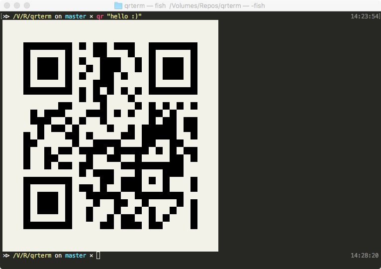

[](https://travis-ci.org/lukasreuter/qrterm)

# qrterm

`qrterm` is a simple but powerful tool to generate and simultaneously display QR-Codes inside your favorite ANSI-compatible Terminal. I came up with the idea during a project which required generation of simple QR-Codes and was wondering why the only other alternative was written in nodejs.
It works on Windows, macOS and Linux platforms.

## Screenshot



## Features

- generates QR-Codes for simple strings and has a lot of subcommands for specific standardized payloads (_wifi_, _mail_, _sms_, _mms_, _geo_, _phone_, _skype_, _whatsapp_, _url_, _bookmark_ and _bitcoin_)
- can output directly to the terminal or alternatively an image file (.png, .bmp and .jpg)
- can generate autocompletion files for your favorite shell (Bash, Zsh, fish and PowerShell!)
- perfect if you want to quickly and seamlessly transfer some data to your own or someone else's smartphone
- lean (about 1.9 Mb on disk), portable cli tool without any external dependencies or runtimes

## Installing `qrterm`

Currently there are two ways to get `qrterm`:

*Support for installing via brew and scoop is pending*

#### Via cargo

You must have the Rust toolchain installed. For installation instructions please visit [rustup.rs](rustup.rs).

```bash
cargo install --git https://github.com/lukasreuter/qrterm
```

#### As binary release

Just select the correct zip for your platform from the [`Release`]() page on the github repository

## TODO

- expand help texts for the subcommands
- Add error texts for some exit branches (mostly file output and qrcode gen)
- implement even more types of qr payloads (contact card, giro payment, calendar event)
- write unit tests for the payloads
- write integration tests for edge case inputs

### Why Rust?

Because it's a new, interesting language that i wanted to dig into :)
Also it was easier to get started due to **kennytm**'s excellent [`qrcode`](https://crates.io/crates/qrcode) crate and **Steven Allen**'s cross-platform capable [`term`](https://crates.io/crates/term) crate that are used for generating and drawing the codes respectively.
Another important motivation was the need for a lean and fast tool that can work with minimal external dependencies, so other high-level languages and frameworks were considered out of the scope for a simple command-line tool.
